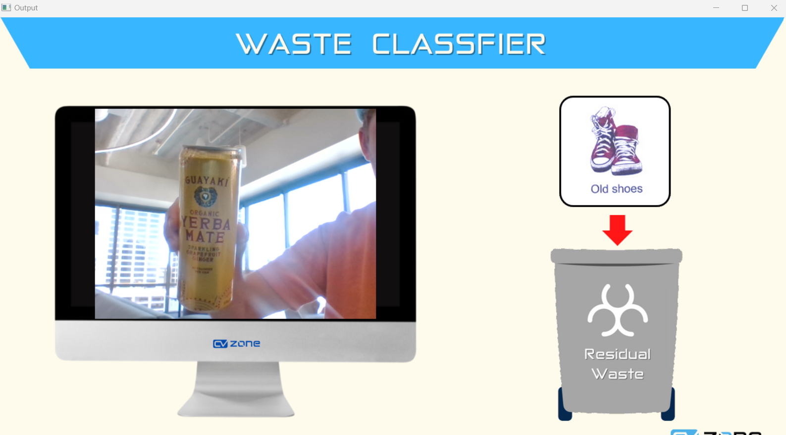
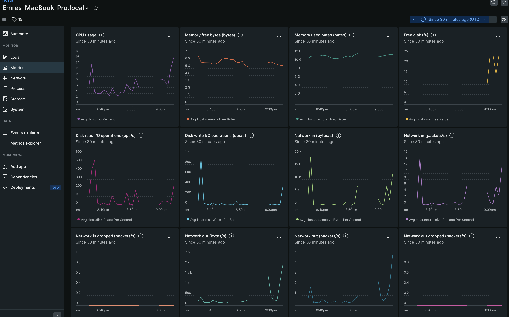

# Waste Classification and Power Management

Using a microcontroller program for recognizing different types of trash and running with New Relic, we can visualize with a screen, above a trash can visualizing the amount of trash thrown away for the day and the power consumption of the microcontroller running the project.

This shows what type of trash there is:

And our Dashboard shows our stats:
