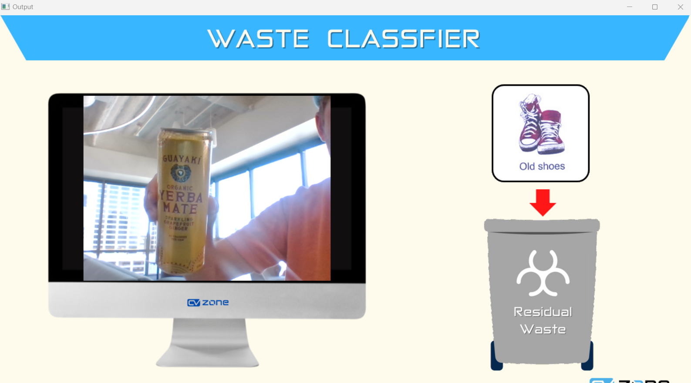

# Waste Classification and Power Management

Using a microcontroller program for recognizing different types of trash and running with New Relic, we can visualize with a screen, above a trash can visualizing the amount of trash thrown away for the day and the power consumption of the microcontroller running the project.

This shows what type of trash there is:


And our Dashboard shows our stats:


## Configure
An example of config files are given but a new .ini file needs to be generated and the host.sh command needs to be configured. The python program also relies on a config file to be named newrelic.ini.

## Run
*Install all deps with*
```
pip install -r requirements.txt
```

*Enable Computer as Host*
```
host.sh
```

launch application:

```
launch.sh
```